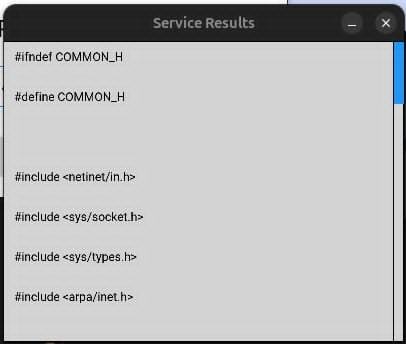

# Jeu de test 

## 1- Compilation :
Pour chaque mode et pour chaque aspect du mode TCP, nous avons compilé les fichiers `make.sh` de la manière suivante :

## 2- Exécution (mode TCP) :
### 2.1- Monoclient/monoserveur :
Tout d'abord, nous avons exécuté le serveur : 

Aprés avoir exécuter le serveur avec succés, nous passons à exécuter le client qui doit etre s'authentifier, puis lancer la demande selon un choix souhaité.

 

### 2.2- Multiclients/monoserveur :

Aprés avoir exécuter le serveur et 2 clients qui sont authentifiés avec succés, le serveur indique les clients qui sont connectés : 

>Chaque client peut alors demander le service à traiter 

### 2.3- Multiclients/multiserveurs :

Le modèle multiclients-multiserveurs repose sur la communication entre plusieurs clients et plusieurs serveurs via un serveur intermédiaire, souvent appelé proxy;

Nous avons alors exécuter tout d'abord le proxy puis les serveurs qui permet chacun d'entre eux de traiter un service(auth,duree,etc..),enfin nous avons exécuté les clients.

Les clients veulent connaitre leur durées de connexion :

`Client 1` :

`Client 2` :

`Proxy` :

`serveur_duree` :

### 2.4- Interface graphique :

`Authentification` :

`Services` :

`Service_date` :

`Service_liste_fichiers` :

Le client passe en arguments le chemin dans-lequel se trouvent les fichiers 

`Service_contenu_fichier` :

Le client passe en arguments le fichier afin d'afficher son contenu

`Service_durée_connexion` :

